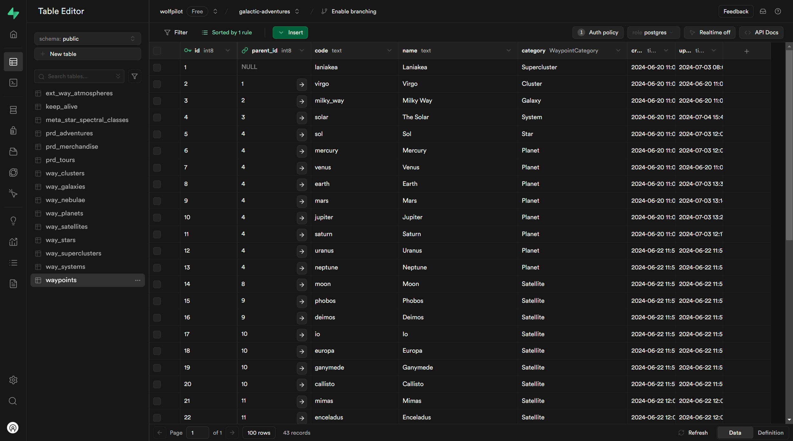
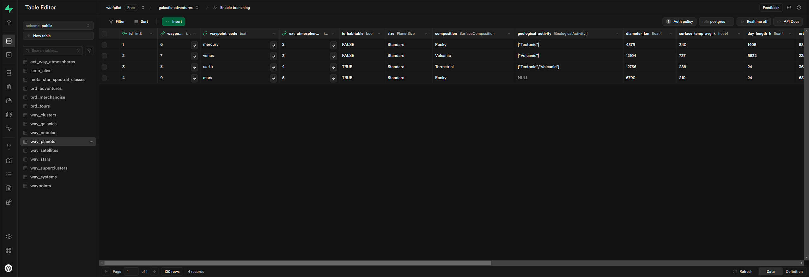
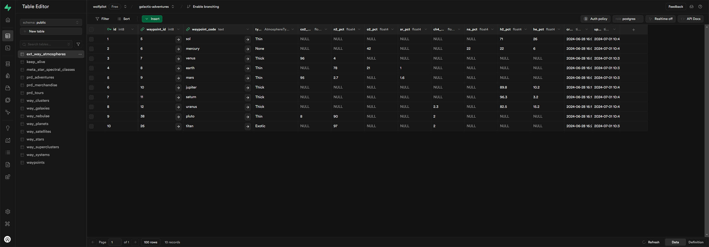
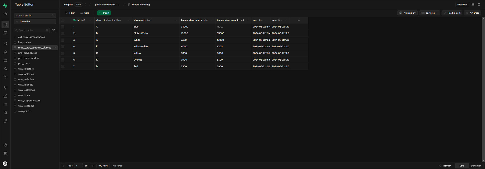
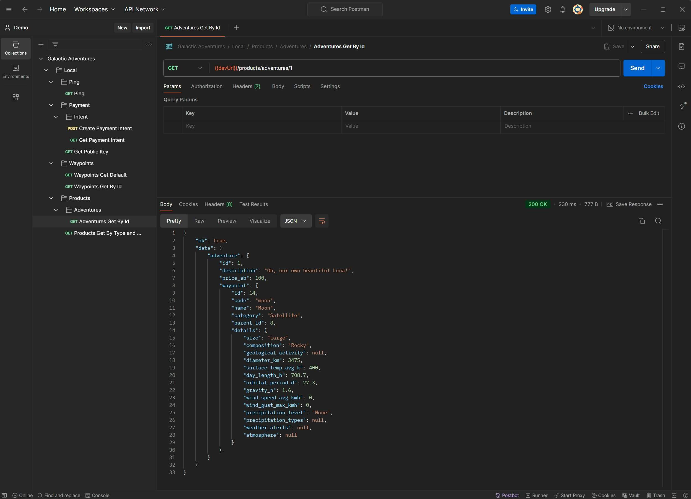

# Galactic Adventures - Server

Implementation of an Express server based on Hexagonal (aka. Ports and Adapters) architecture, along with Supabase SQL DB and Stripe for payments.

## Table of contents

- [Intro](#intro)
- [Demo](#demo)
- [Features (done)](#features-done)
- [Features (TBA)](#features-tba)
- [Technologies](#technologies)
- [API](#api)
- [Security](#security)
- [Getting started](#getting-started)
- [Resources](#resources)
- [License](#license)

## Intro

Sibling repo of [Galactic Adventures - Client](https://github.com/wolfpilot/galactic-adventures-client), make sure you check both out!

_So, what is this exactly?_

Imagine a travelling app... except it's in SPACE! And since I am optimistic about our future, let's assume you can travel anywhere; to any planet, any galaxy, heck, even other superclusters! Sounds awesome, right?

The issue with representing something like this in a relational database is exactly that, the relationships. Planets may be part of solar systems, however they may also be rogue. Space stations may reside close to a planet or they could be in some faraway nebula. Some solar systems are binary, some are trinary. Things can easily escalate out of proportion without any clear indication as to what is part of what.

Now, you might be wondering, but why did you not use a graph database? And the honest answer would be, I did not think about it until I was well-down the rabbit hole. Then, presented with the choice of learning an entirely new type of DB or adapting something I had a grasp on to my needs, I chose the latter.

Let me introduce you to the solution: the [adjacency list pattern](https://medium.com/@rishabhdevmanu/from-trees-to-tables-storing-hierarchical-data-in-relational-databases-a5e5e6e1bd64) (pictured below).

### Table Structure

_waypoints_ - Stores all the parent and child nodes, as well as shared columns.



_way_planets_ - Holds planet-specific data. Some column duplication (waypoint_code) is required to make the values more human-readable.



_ext_way_atmospheres_ - An extension table which does not contain entities on its own.



_meta_star_spectral_classes_ - A metadata table containing static data relating to the star classes.



## Demo

**IMPORTANT**: Please have patience as **the first request may take up to one minute**.
That's because on Render's free hosting plans the servers spin down after 15 minutes of inactivity.

- Ping: [https://wolfpilot-galactic-adventures-server.onrender.com/ping](https://wolfpilot-galactic-adventures-server.onrender.com/ping)
- Waypoint - Mars: [https://wolfpilot-galactic-adventures-server.onrender.com/waypoints/9](https://wolfpilot-galactic-adventures-server.onrender.com/waypoints/9)
- Adventure - Moon: [https://wolfpilot-galactic-adventures-server.onrender.com/products/adventures/1](https://wolfpilot-galactic-adventures-server.onrender.com/products/adventures/1)
- Payment - Pluto : [https://wolfpilot-galactic-adventures-server.onrender.com/payment/intent/pi_3Q0rb3IOgdrQNMoY1YNx5MrS](https://wolfpilot-galactic-adventures-server.onrender.com/payment/intent/pi_3Q0rb3IOgdrQNMoY1YNx5MrS)

For more details and examples, see [API](#api).

Postman



## Features (done)

- Architecture

  - Hexagonal
  - DIP (Dependency Inversion Principle)
  - Adjacency list pattern
  - RESTful API
  - CRUD

- Middleware

  - Debug console logger
  - Request and error loggers with daily rotated files
  - Request body content type validation
  - Schema-based error validation
  - Rate limited

- Config

  - Import path aliases using tsconfig-paths
  - Localised .env files using dotenv-flow

- QOL (Quality of Life)
  - Automatically sync DB schema on pre-commit

## Features (TBA)

- [x] Custom HTTP, Service, Repository errors
- [x] Keep-alive cronjob
- [ ] Stripe webhooks for post-payment processing
- [ ] Price calculator service per distance travelled
- [ ] New products: merchandise and tours
- [ ] User authentication
- [ ] Elastic search

## Technologies

- Languages
  - [TypeScript](https://www.typescriptlang.org/)
- Server
  - [Node.js](https://nodejs.org/)
  - [Express](https://expressjs.com/)
- Database
  - [PostgreSQL](https://www.postgresql.org/)
  - [Supabase](https://supabase.com/)
- Payment
  - [Stripe](https://stripe.com/)
- Config
  - [tsconfig-paths](https://www.npmjs.com/package/tsconfig-paths)
  - [dotenv-flow](https://www.npmjs.com/package/dotenv-flow)
- Linting & formatting
  - [EsLint](https://eslint.org/)
  - [Prettier](https://prettier.io/)
- Validation
  - [JSON Schema 7](https://json-schema.org/understanding-json-schema/)
- Rate limiting
  - [Express Rate Limit](https://github.com/express-rate-limit/express-rate-limit)
- Testing
  - [Vitest](https://vitest.dev/)
  - [Supertest](https://www.npmjs.com/package/supertest)
  - [Postman](https://www.postman.com/)
- Logging
  - [Winston](https://www.npmjs.com/package/winston)
- CI/CD
  - [Husky](https://www.npmjs.com/package/husky)
    - Pre-commit
    - Pre-push
  - [Render](https://www.render.com/)
    - Hosting server and DB

## API

Either start your own server and visit [http://localhost:9000](http://localhost:9000) or [https://wolfpilot-galactic-adventures-server.onrender.com](https://wolfpilot-galactic-adventures-server.onrender.com).

### Endpoints

```
# Ping
  GET    /ping                                           - check server status

# Waypoints
  GET    /waypoints                                      - fetch default waypoint
  GET    /waypoints/:id                                  - fetch a single waypoint

# Products
  GET    /products?type={productType}&id={productId}     - fetch a single product
  GET    /products/adventures/:id                        - fetch a single adventure

# Payment
  GET    /payment                                        - fetch the Stripe Public Key
  POST   /payment/intent                                 - create a new Stripe Payment Intent
  GET    /payment/intent/:id                             - fetch an existing Payment Intent
```

### Examples

Simply copy-paste the following examples in your bash terminal making sure to separate newlines with "\\" on Mac or "^" on Windows.

If running locally, please use "http://localhost:9000" instead. Alternatively, import the collection below in your own Postman instance and have some fun!

[](https://god.gw.postman.com/run-collection/:1901372-4b2d2dfd-6cde-4674-8dbf-65e4a5e39ee6)

#### Ping to awaken or check server status

- GET /ping

```bash
curl \
  -H      'Content-Type: application/json' \
  -X GET 'https://wolfpilot-galactic-adventures-server.onrender.com/ping'
```

#### Get the default / top parent waypoint

- GET /waypoints/null

```bash
curl \
  -H     'Content-Type: application/json' \
  -X GET 'https://wolfpilot-galactic-adventures-server.onrender.com/waypoints/null'
```

#### Get a waypoint by ID

- GET /waypoints:id

```bash
curl \
  -H     'Content-Type: application/json' \
  -X GET 'https://wolfpilot-galactic-adventures-server.onrender.com/waypoints/4'
```

#### Get a product by type and ID

- GET /products?type={productType}&id={productId}=

```bash
curl \
  -H 'Content-Type: application/json' \
  -X GET 'http://localhost:9000/products?type=adventure&id=1'
```

#### Get an adventure by ID

- GET /products/adventures/:id

```bash
curl \
  -H 'Content-Type: application/json' \
  -X GET 'https://wolfpilot-galactic-adventures-server.onrender.com/products/adventures/1'
```

#### Create a Stripe Payment Intent

- POST /payment/intent

```bash
curl \
  -H 'Content-Type: application/json' \
  -X POST 'https://wolfpilot-galactic-adventures-server.onrender.com/payment/intent' \
  -d '{
    "productType": "adventure",
    "productId": "1"
  }'

Body:
  productType
    type: "adventure" | "merchandise" | "tour"
  productId
    type: string
```

#### Get a Stripe Payment Intent by ID

- GET /payment/intent/:id

```bash
curl \
  -H 'Content-Type: application/json' \
  -X GET 'https://wolfpilot-galactic-adventures-server.onrender.com/payment/intent/pi_3Pz0UxIOgdrQNMoY1CEor4ck'
```

## Security

Broadly speaking, security concerns can be divided into three parts:

1. API abuse, such as DDOS attacks.

   - Implementing a rate limiter at max 1000 req/min.

2. Database abuse, such as unauthorised access, SQL injection and leaks in logging.

   - Enabling Supabase RLS (Row Level Security) with the only custom policy set to SELECT.
   - Using Supabase JS client which sanitises all queries automatically.
   - Parsing all errors, including PG, before they are thrown to the logger middleware.
   - Ignoring all .env file configs (except for the example) from being commited.
   - Returning error 5xx for server-related errors without any additional context.

3. Payment gateway abuse, such as XSS/CSRF attacks and key leaks.
   - Validating all requests against unexpected inputs via JSON schema.
   - Minimising possible attack areas by using popular, verified open-source 3rd party libs.

Realistically, there will always be unknown vectors of attack as no API is truly 100% secure and, as is often the case, with more complexity comes more risk.

For the scope of this project (and for the sake of me getting some sleep), let's call this good enough :)

## Getting started

### Requirements

- [Node.js](https://nodejs.org/en/) (built on v20.0.14)
- [Pnpm](https://pnpm.io/) (built on v9.1.4)

### Installation

```bash
$ git clone https://github.com/wolfpilot/galactic-adventures-server.git
$ cd galactic-adventures-server
$ pnpm install
```

### Steps

```bash
# 1. Update your env config, see .env.example for guidance.

# 2. Run the API service
$ pnpm start:dev
```

## Resources

### Guides

- Recommended reading for anyone new to [Building a REST API: A Hexagonal Approach](https://medium.com/@christianinyekaka/building-a-rest-api-a-hexagonal-approach-with-typescript-typeorm-postgresql-and-jwt-946d372860ee) by Christian Inyekaka
- An intro to [Polymorphic Relationships and how they work]() by Hendel Ramzy

### References

- Example [repo](https://github.com/LordMoMA/Hexagonal-Architecture) for Hexagonal Architecture by David Lee

### Credits

- Data sourced from [NASA](https://science.nasa.gov/), [Wikipedia](https://en.wikipedia.org/) and a dozen others
- Photography and generated image credits go to [NASA](https://science.nasa.gov/)

## License

This project is licensed under the [MIT License](LICENSE).
